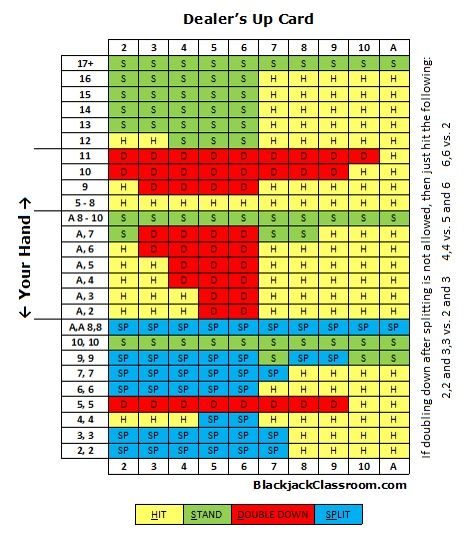

# Blackjack

## Sobre
Blackjack ou Vinte-e-um é um jogo jogado com cartas de baralho e o objetivo é ter mais pontos do que o adversário, mas sem ultrapassar os 21, caso em que se perde.

Algumas regras básicas do jogo:
- As cartas são ilimitadas
- Não há Joker
- Cada carta numérica vale respectivamente o seu valor
- As cartas Valete/Rainha/Rei valem 10, cada uma
- O Às pode valer 1 ou 11, a depender do caso
- Todas as cartas têm a mesma probabilidade de serem sorteadas
- As cartas não são removidas do deck quando baixadas
- O computador será o dealer

É possível traçar diversas estratégias para ganhar o jogo, conforme mostra a tabela abaixo.

## Como funciona
A partida começa com o Jogador recebendo duas cartas e tendo automaticamente seu score calculado.

As cartas do Jogador são mostradas apenas para o Jogador e apenas uma das cartas do Computador será visível, estando a outra escondida.

É perguntado se o Jogador deseja puxar uma nova carta. É aqui que começa a estratégia. Faça as contas. Analise o risco e tome a decisão.

Se o Jogador puxar novas cartas e ultrapassar 21, ele perde; se o Jogador não puxar e o Computador já tiver um blackjack, este será o vencedor.

O Computador automaticamente vai puxar cartas sempre que seu score for menor que 17.

Se o Jogador e o Computador tiverem o mesmo score ao final, a partida será empate.

## Teste
Para executar o script online [clique aqui](https://replit.com/@vhsenna/blackjack#main.py).
